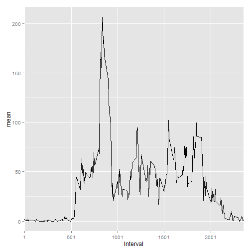
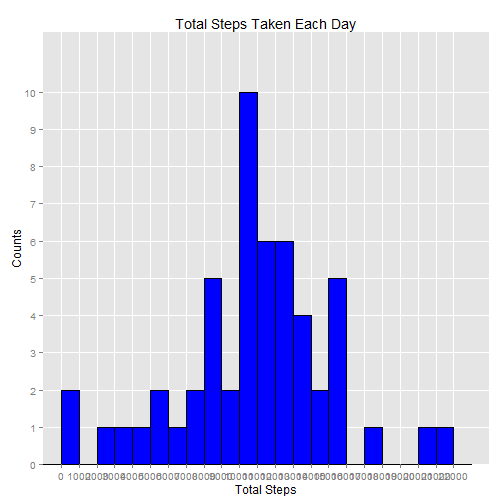
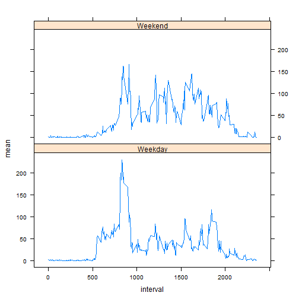

# Reproducible Research: Peer Assessment 1
=================
Miklos Schmidt

## Loading and preprocessing the data


```r
activity <- read.csv("activity.csv", colClasses=c("numeric","Date","numeric"),header=TRUE)
```


## What is the mean total number of steps taken per day?


```r
library(plyr)
total_steps <- na.omit((ddply(activity[1:2],"date",numcolwise(sum))))
```


### Making a histogram of the total number of steps  taken each day


```r
library(ggplot2)
ggplot(total_steps, aes(steps)) +
        geom_histogram(fill = "blue", colour = "black", binwidth = 1000) +
        scale_x_discrete(name = "Total Steps", breaks = seq(0,22000,by = 1000)) +
        scale_y_discrete(name = "Counts", breaks = c(0:10)) +
        labs(title ="Total Steps Taken Each Day")
```

 


### Calculate and report the mean and the median total number of steps taken per day


```r
median <- median(total_steps$steps)
mean <- mean(total_steps$steps)
print(paste("The mean total number of steps taken per day is", round(mean, digits = 2)))
```

```
## [1] "The mean total number of steps taken per day is 10766.19"
```

```r
print(paste("The median total number of steps taken per day is", median))
```

```
## [1] "The median total number of steps taken per day is 10765"
```


## What is the average daily activity pattern?


### Making a time series plot of the 5-minute interval and the average number of steps taken, averaged across all days


```r
interval_mean <- ddply(activity, .(interval), summarize, mean = mean(steps, na.rm =TRUE))
ggplot(interval_mean, aes(x = interval, y = mean)) + 
        geom_line() + 
        scale_x_discrete(name = "Interval", breaks = seq(1,2355,500))
```

 


### Which 5-minute interval, on average across all the days in the dataset, contains the maximum number of steps?


```r
max_interval <- subset(interval_mean, mean == max(mean))$interval
print(paste("The", max_interval, "5-minute interval contains the maximum number of steps."))
```

```
## [1] "The 835 5-minute interval contains the maximum number of steps."
```


## Imputing missing values


### Calculate and report the total number of missing values in the dataset


```r
missing_values <- sum(is.na(activity$steps))
print(paste("There are",missing_values,"missing values."))
```

```
## [1] "There are 2304 missing values."
```

### Strategy for fillin in all of the missing values in the dataset

I will replace the missing values with the mean of the corresponding 5-minute-interval. E.g. is there is a missing value for the 805th interval, i replace the NA with the mean of the 805th interval.

### Creating a new dataset where NA values replaced with the mean of the correspondig 5-minute-interval

```r
activity_filled <- activity
for (i in 1: dim(activity_filled)[1]) {
        if (is.na(activity_filled[i,1]) == TRUE) {
                activity_filled[i,1] <- subset(interval_mean, interval == activity_filled[i,3])[2]
                }
        }
```


### Making a histogram of the total number of steps taken each day and Calculate and report the mean and median total number of steps taken per day.


```r
library(plyr)
total_steps_filled <- (ddply(activity[1:2],"date",numcolwise(sum)))
library(ggplot2)
ggplot(total_steps_filled, aes(steps)) +
        geom_histogram(fill = "blue", colour = "black", binwidth = 1000) +
        scale_x_discrete(name = "Total Steps", breaks = seq(0,22000,by = 1000)) +
        scale_y_discrete(name = "Counts", breaks = c(0:10)) +
        labs(title ="Total Steps Taken Each Day")
```

 

```r
median_filled <- median(total_steps$steps)
mean_filled <- mean(total_steps$steps)
print(paste("The mean total number of steps taken per day is", round(mean_filled, digits = 2)))
```

```
## [1] "The mean total number of steps taken per day is 10766.19"
```

```r
print(paste("The median total number of steps taken per day is", median_filled))
```

```
## [1] "The median total number of steps taken per day is 10765"
```


The new values don't differ from the estimates of the first part of the assisgment. It happens because I used the means for replacing the NA values.

Imputing missing data increases the estimates of the total daily number of steps, because we add new positive numbers to the estimates.


## Are there differences in activity patterns between weekdays and weekends?


### Creating a new factor variable


```r
week <- factor (c("Weekend","Weekday"))
activity_filled$weekend <- week[2]
for (i in 1:dim(activity_filled)[1]) {
        if ((weekdays(activity_filled[i,2]) %in% c("Saturday","Sunday")) == T) {
                activity_filled$weekend[i] <- week[1]
        }        
}
```


### Making a panel plot containing a time series plot (i.e. type = "l") of the 5-minute interval (x-axis) and the average number of steps taken, averaged across all weekday days or weekend days (y-axis).


```r
interval_mean_weekend_filled <- ddply(subset(activity_filled, weekend == "Weekend"), .(interval), summarize, mean = round(mean(steps, na.rm =TRUE),2))
interval_mean_weekday_filled <- ddply(subset(activity_filled, weekend == "Weekday"), .(interval), summarize, mean = round(mean(steps, na.rm =TRUE),2))
interval_mean_weekend_filled$day <- "Weekend"
interval_mean_weekday_filled$day <- "Weekday"
data <- rbind(interval_mean_weekend_filled,interval_mean_weekday_filled)
library(lattice)
xyplot(mean ~ interval | day, data = data, type = "l", layout = c(1,2))
```

 


